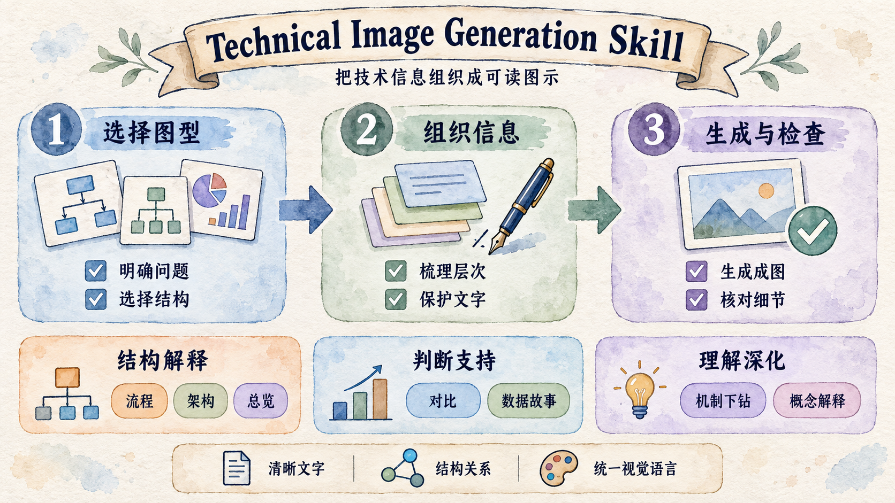
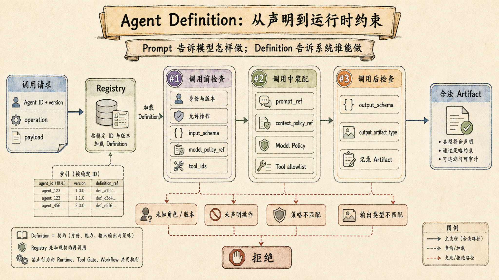
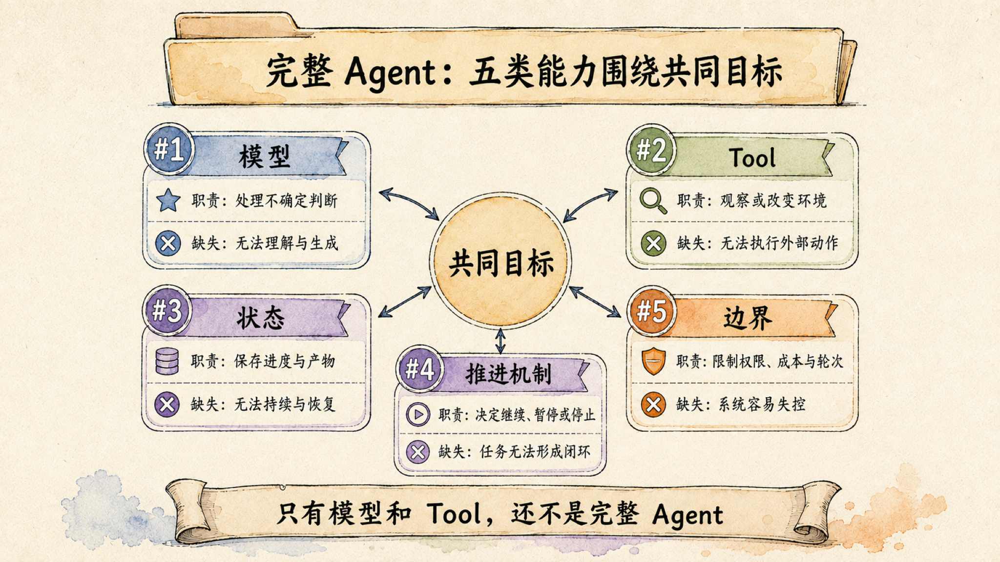
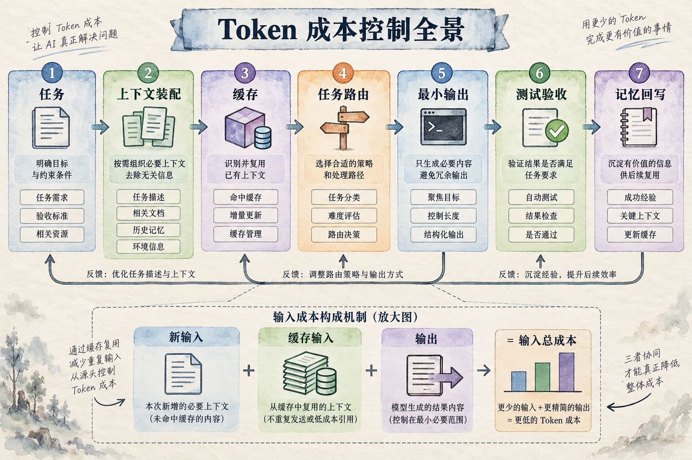
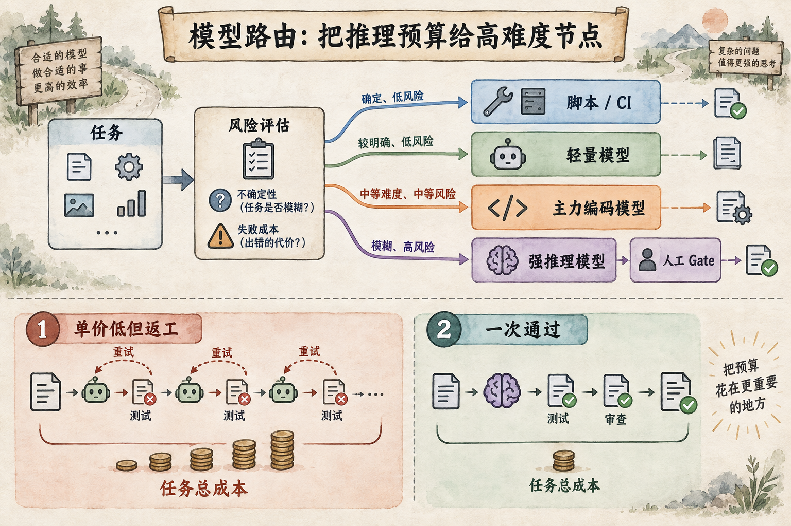
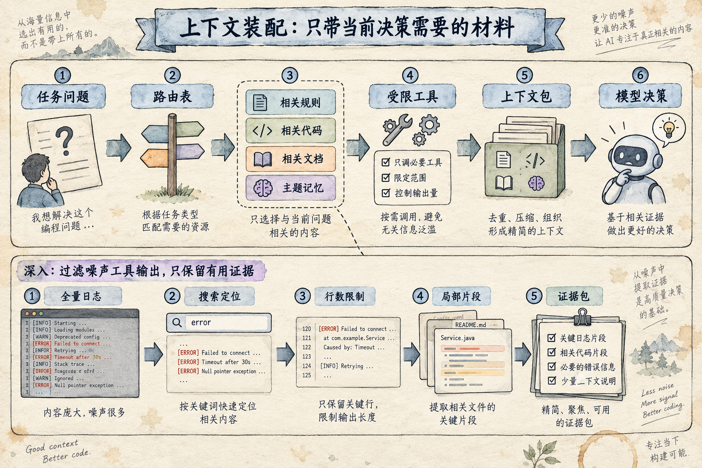
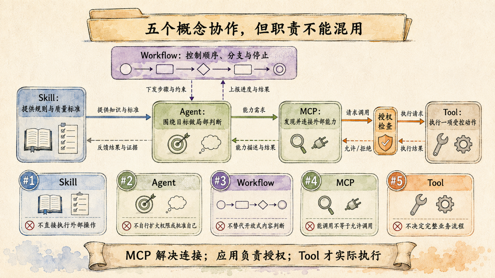
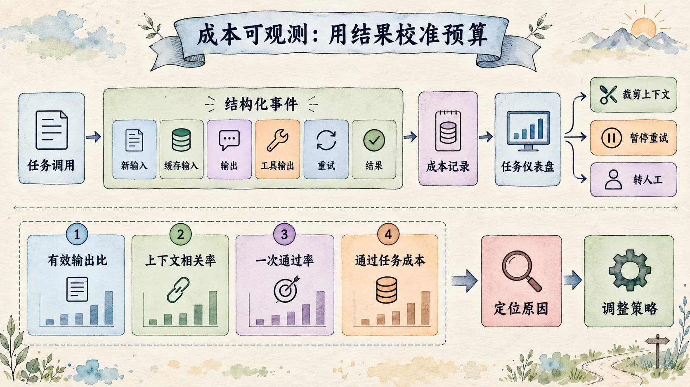

# Technical Image Generation Skill / 技术插图生成 Skill

`technical-image-generation-skill` 用于制作有明确解释任务的技术插图。它定义了一套可复用的水彩信息图语言：米白纸纹、细墨线、低饱和蓝绿紫橙、编号卡片、清楚的箭头和克制的图例。

它不绑定任何产品、工作流或发布渠道。你可以把它用于文章、演示文稿、设计文档、产品说明、培训材料或技术复盘；前提是图片确实能让读者更快理解一个问题。

## Skill Overview / Skill 总览

这张总览图把七种解释任务放在同一张图里，并用底部图例强调清晰文字、结构关系和统一视觉语言。

## What It Covers / 覆盖范围

- 全景概览与心智模型 / ecosystem overviews and mental models
- 流程、生命周期与反馈回路 / processes, lifecycles, and feedback loops
- 系统架构与边界说明 / system architecture and boundaries
- 方案对比与取舍 / option comparison and trade-offs
- 单一机制下钻 / single-mechanism deep dives
- 抽象概念的技术解释 / technical explanation of abstract concepts
- 数据趋势与决策提示 / data trends and decision cues

## How To Use / 使用方法

1. 阅读 [SKILL.md](SKILL.md)，明确图片要回答的问题，并选择对应的 `references/` 模板。
2. 写出一句话结论，列出必须逐字保留的文字。
3. 按模板填充内容，再用主 Skill 的 Prompt 框架组织成完整请求。
4. 生成后依照 [quality-checklist.md](references/quality-checklist.md) 检查文字、关系、版式与风格。
5. 每轮只修一个最影响理解的问题；连续三轮仍无改善时，缩小范围或拆图。

1. Read [SKILL.md](SKILL.md), state the question the visual must answer, and choose the relevant `references/` template.
2. Write the one-sentence takeaway and list text that must remain verbatim.
3. Fill the selected template, then assemble a complete request using the core prompt frame.
4. After generation, check copy, relationships, layout, and style with [quality-checklist.md](references/quality-checklist.md).
5. Repair only the single issue that most harms comprehension per round; after three unsuccessful rounds, narrow or split the visual.

## Sample Gallery / 样例展示

每个图型保留一张代表图。图片先以宫格展示，随后说明各图型的构图要点。

One representative image is kept for each illustration family. The grid appears first, followed by notes on each composition pattern.

### Images / 图片展示

<table>
<tr>
<td width="50%" valign="top">

 <strong>Process / 流程</strong>
 编号主路径与失败分支。 Numbered primary path with failure branches.
</td>
<td width="50%" valign="top">

 <strong>Architecture / 架构</strong>
 组件、职责与关系边界。 Components, responsibilities, and relationship boundaries.
</td>
</tr>
<tr>
<td width="50%" valign="top">

 <strong>Overview / 总览</strong>
 全局路径加一个局部放大区。 Whole-system path with one bounded zoom-in.
</td>
<td width="50%" valign="top">

 <strong>Comparison / 对比</strong>
 固定维度下的选择与取舍。 Choices and trade-offs on fixed dimensions.
</td>
</tr>
<tr>
<td width="50%" valign="top">

 <strong>Deep Dive / 机制下钻</strong>
 聚焦一个可追踪的局部机制。 One traceable local mechanism.
</td>
<td width="50%" valign="top">

 <strong>Conceptual Explainer / 概念解释</strong>
 从直觉回到术语与适用边界。 From intuition back to terms and scope.
</td>
</tr>
<tr>
<td width="50%" valign="top">

 <strong>Data Story / 数据故事</strong>
 指标、观察点与决策在同一路径上。 Metrics, observations, and decisions on one path.
</td>
<td width="50%" valign="top"></td>
</tr>
</table>

## What Good Output Looks Like / 好图的标准

一张合格图不是“内容很多的漂亮图片”。它应让读者在几秒内知道主题，在半分钟内走完整条主路径，并能在回看时准确找到关键边界、反馈或例外。文字、数字与连线出错时，宁可重做，也不要拿“手绘感”搪塞。